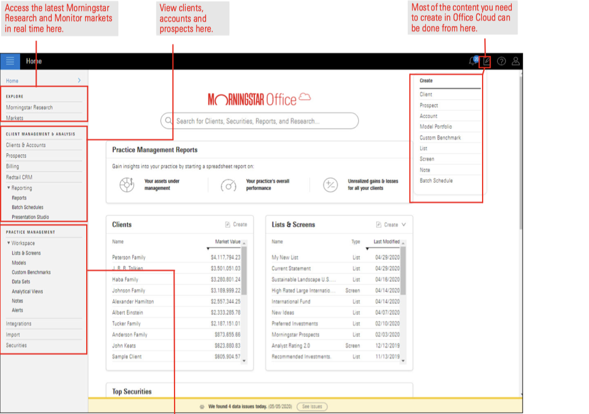
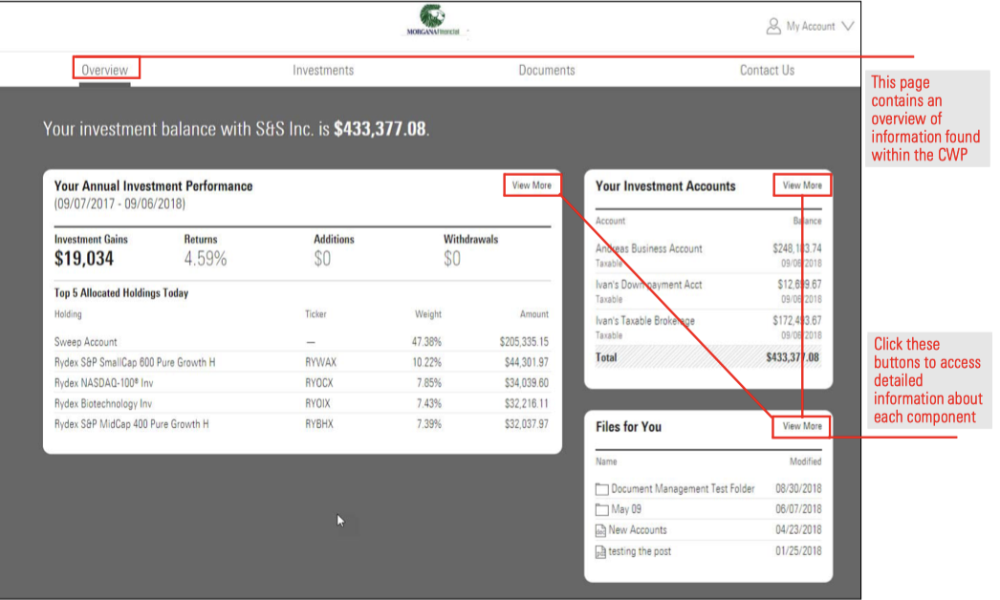
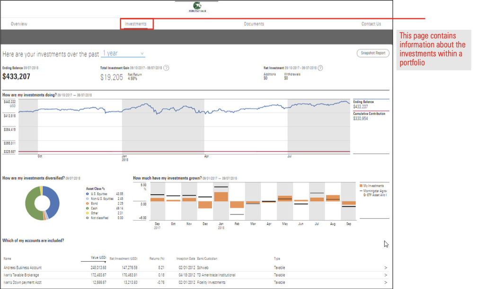
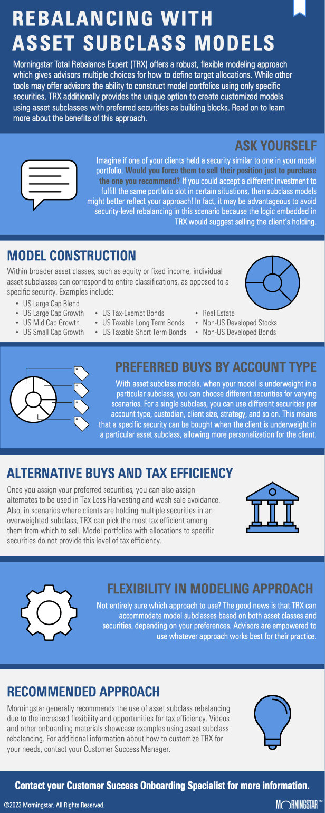
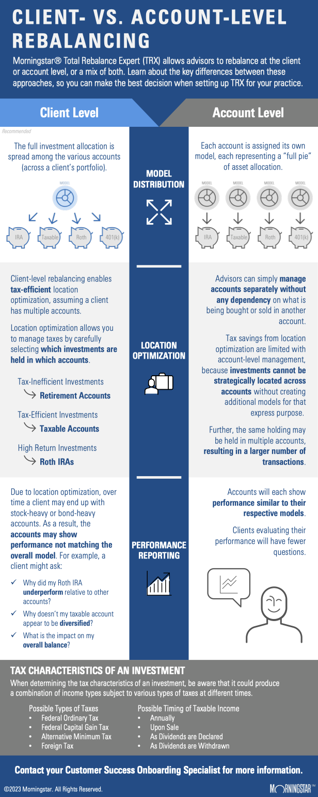

# `Columbia Engineering FinTech Bootcamp 2023-06 Cohort`

## `Project: Module 01 Intro-to-FinTech-Challenge`

## Case Study: Morningstar Office README 

## Background
> As a fintech professional, it’s critical for us to understand how fintech companies start, evolve, and grow, to be able to speak knowledgeably about the major players in the industry, and to stay up-to-date on advances in the rapidly evolving fintech field.

## Purpose
> In this activity, we use the ***case study*** method to conduct corporate research of a fintech business that analyzes how the company is addressing the needs and challenges in its fintech domain and using technology to solve a standing financial problem.

> In this Challenge, we will do the following:
> 1. Select a fintech domain that interests us, and then choose a company or project within that domain.
> 2. Research the domain and company.
> 3. Write a focused and detailed case study of the company or project.
> 4. Upload the [case study](https://github.com/boz-tcm/intro-to-fintech-challenge/blob/master/README.md) to our [git repository](https://github.com/boz-tcm/intro-to-fintech-challenge.git).

## Table of Contents
* [Background](#background)
* [Purpose](#purpose)
* [The Case Study - Morningstar](#the-case-study---morningstar)    
* [Technologies Used in this Project](#technologies-used)
* [Setup Documentation for this Project](#setup)
* [Project Status](#project-status)
* [Room for Improvement](#room-for-improvement)
* [Acknowledgements](#acknowledgements)
* [Contact](#contact)
<u>
## The Case Study - Morningstar Office
</u>

*`This Case Study is presented in a question and answer format.`*[^1]

- ## Overview and Origin

    * Name of company:
    
        `Morningstar, Inc. (the "Company"), headquartered in Chicago, IL, and publicly traded with most recent market cap valuation of $8.76 billion (Yahoo! Finance, June 2023).`

        `This case study focuses on Morningstar, Inc.'s` <u>**`Morningstar Office Cloud`**</u> `product for investment advisers and their clients.`

    * When was the company incorporated?
    
        `According to Morningstar's latest SEC annual report, the Company was incorporated in 1984 (SEC Annual Report, February 2023).`

    * Who are the founders of the company?
    
        `The Company's founder is Joe Mansueto, who has served as Chairman of the board since inception, and as CEO from 1984 to 1996 and from 2000 to 2016 (SEC Annual Report, February 2023).  The Morningstar name was inspired by the last line of Henry David Thoreau's novel 'Walden', which the founder Joe Mansueto read in college:`
        > `"The sun is but a morning star." - Henry David Thoreau (`*`Walden`*`, 1854)`

        `(Morningstar Website - Our History.)`

    * How did the idea for the company (or project) come about?
    
        `The idea for Morningstar, specifically the Morningstar Office Cloud product, originated from familiarity with the Company in both the Wealth Management and Investment Management fintech domains, where the Company has a long history with origins as a leader in the analysis and rating of mutual funds.`

    * How is the company funded? How much funding have they received?
    
        `The Company is funded by publicly traded equity with a book value of $1.2 billion and short and long-term debt of $1.1 billion (Yahoo! Finance, June 2023).` 

- ## Business Activities

    * What specific financial problem is the company or project trying to solve?
    
        `The Company's mission since its founding has been to deliver financial information and analysis to its clients so that they can make better investment decisions.`    

    * Who is the company's intended customer?  Is there any information about the market size of this set of customers?
        
        `According to Gitnux, Morningstar "generates revenue through a diverse range of products and services catered to institutional and individual investors, as well as financial advisors" (2023).`

    * What solution does this company offer that their competitors do not or cannot offer? (What is the unfair advantage they utilize?)
    
        `Pursuant to its original mission in 1984, Morningstar has amassed proprietary ratings information and analysis covering a large proportion of the mutual fund industry.  The Company has since expanded this mission to include ratings and data analysis for publicly traded businesses.  Morningstar's mission is to deliver this information to  clients, including corporate and individual investors, and financial advisors, through various captive channels such as Morningstar Direct, Morningstar Advisor Workstation, and Morningstar Office (SEC Annual Report, February 2023).` 

    * Which technologies are they currently using, and how are they implementing them? (This may take a little bit of sleuthing–– you may want to search the company’s engineering blog or use sites like Stackshare to find this information.)
    
        `According to personal firsthand conversations with Morningstar's Customer Success Manager (CSM), Anthony Odro, the Company primarily relies on Amazon's AWS cloud services to deliver its proprietary investment ratings data, solutions, and services to clients.`

        `In addition to Amazon AWS, StackShare shows that Morningstar uses the following technologies, among others:`
            
        - `jQuery, php, Java, Apache, Ruby, for web development and deployment;`
            
        - `CloudFlare for cloud security and delivery efficiency;`
            
        - `Google Analytics for analyzing web traffic to Morningstar online properties;`
            
        - `and New Relic for internal server performance and load monitoring.`
            
        - `The full list of Morningstar technologies documented by StackShare is available` [here](https://github.com/boz-tcm/intro-to-fintech-challenge/blob/master/Resources/Sources/MorningstarOfficeStackShare.pdf).

        `The Company deploys and maintains its Morningstar Office product through both the Cloud, via an internet web application, and a legacy version through a local Desktop C++ distributed application.  Both product types provide a suite of functionality for investment adviser users, including Clients & Accounts management, CRM database management delivered through Redtail CRM, a third-party vendor, Firm-level and individual Client reporting, Client Billing, including batch scheduling, and Research tools, including Morningstar analyst research covering individual company securities, mutual and exchange-traded funds, and annuities.`

        - `Morningstar Office Cloud: Investment Adviser Practice Home Page and Tools Preview:`
            
            
        
        `A separate website also provides a client-facing web portal, delivered synchronously from the same underlying database sources serving investment advisers through their Cloud and Desktop applications.  The client-facing web portal provides clients with historical household balance information by account custodian, through either a direct data feed with custodians or through Morningstar's third-party data aggregation service, ByAllAccounts (BAA).  Morningstar's Back-Office Services (BOS) reconciles these data feeds and client account balances and positions daily prior to the U.S. market open.  In addition to reporting on account balances and securities holdings information, the client web portal supports secure document storage and sharing between investment advisers and their clients.`

        - `Client Web Portal: Overview and Investment Page Previews:`

            

            

        `Morningstar also maintains a sophisticated asset allocation rebalancing and tax management website application for investment advisers, called Morningstar tRx, or Total Rebalance Expert, which was initially developed and commercialized by a third-party startup that is now wholly-owned by Morningstar (Neal, 2015).`

       - `Total Rebalance Expert: Infographics:`

            

            

        `Additional detailed tech specifications for both Morningstar Office Cloud and legacy Morningstar Office` *`Desktop`* `product versions is available` [here](https://github.com/boz-tcm/intro-to-fintech-challenge/blob/master/Resources/Sources/MorningstarOfficeTechSpec.pdf)`.`

- ## Landscape

    * What domain of the financial industry is the company in?
    
        `Morningstar offers its services primarily within the Wealth Management and Investment Management financial industry domains (Smith, 2022).`

    * What have been the major trends and innovations of this domain over the last 5-10 years?

    * What are the other major companies in this domain?
    
        `Other major companies offering similar services as Morningstar in the Wealth Management and Investment Management domains include:`
        
        `1. Bloomberg`

        `2. S&P Global`
        
        `3. Envestnet, parent company of competitor MoneyGuide`
        
        `4. Fidelity, parent company of competitor eMoney`
        
        `5. Orion`

        `(Sources: G2.com; Kitces.com)`

- ## Results

    * What has been the business impact of this company so far?
    
        ``

    * What are some of the core metrics that companies in this domain use to measure success? How is your company performing, based on these metrics?

        ``

    * How is your company performing relative to competitors in the same domain?

        ``

- ## Recommendations

    * If you were to advise the company, what products or services would you suggest they offer? (This could be something that a competitor offers, or use your imagination!)
    
        `I would recommend to the Company that they continue to build out and reinvest in their Investment and Wealth Management platforms to bring more features and services to their delivery platforms, including through their Morningstar Direct, Advisor Workstation, and Morningstar Office Cloud platforms.  For example, the Company's Advisor Workstation and Office Cloud platforms could be greatly improved`

    * Why do you think that offering this product or service would benefit the company?

        ``

    * What technologies would this additional product or service utilize?

        ``

    * Why are these technologies appropriate for your solution?

        ``

- ## References

    [^1]: A numbered footnote convention will generally not be used in this case study: references will instead be identified using MLA Source and Date citation convention, and listed [here](#references).  However, this numbered footnote instance illustrates how footnotes may be implemented in Markdown. Note that this footnote reference would not render properly, if at all, in VS Code prior to identification and installation of the VS Code extension developed by Matt Bierner, see VS Code Extension ID [bierner.markdown-footnotes](https://marketplace.visualstudio.com/items?itemName=bierner.markdown-footnotes).

    * G2.com, "Top 10 Morningstar Office Alternatives & Competitors," https://www.g2.com/products/morningstar-office/competitors/alternatives.

    * Gitnux.com, "Morningstar: Business Model, SWOT Analysis & Competitors 2023," April 10, 2023, https://blog.gitnux.com/companies/morningstar.

    * Iskowitz, Craig, "50 Portfolio Management Software Solutions For Advisors Can’t All Survive," July 23, 2020, https://www.kitces.com/blog/portfolio-management-trading-rebalancing-software-review-fintech-competition-addressable-market-size.

    * Morningstar Office Cloud and Desktop technical specifications, https://github.com/boz-tcm/intro-to-fintech-challenge/blob/master/Resources/Sources/MorningstarOfficeTechSpec.pdf.

    * Morningstar, Inc. Corporate Website - Our History, https://www.morningstar.com/company/about-us/timeline.

    * Morningstar SEC Annual Report on Form 10-K for the period ending December 31, 2022, as of February 24, 2023, https://www.sec.gov/ix?doc=/Archives/edgar/data/1289419/000128941923000005/morn-20221231.htm.

    * Neal, Ryan, "Morningstar Purchases tRx Portfolio Rebalancing Platform," October 9, 2015, https://www.wealthmanagement.com/technology/morningstar-purchases-trx-portfolio-rebalancing-platform.

    * Singers, Mattias, "awesome-readme" demonstrated use of html `` tag within README, https://github.com/matiassingers/awesome-readme.

    * Smith, Andy, "Who Are Morningstar's (MORN) Main Competitors," August 23, 2022, https://www.investopedia.com/ask/answers/051915/who-are-morningstars-morn-main-competitors.asp.

    * StackShare, https://stackshare.io/morningstar/morningstar.

    * Wikipedia reference for Markdown, https://en.wikipedia.org/wiki/Markdown#cite_note-philosophy-9.

    * Yahoo! Finance, June 15, 2023, https://finance.yahoo.com/quote/MORN?p=MORN.

## Technologies Used
- README Markdown file for Case Study developed within VS Code IDE.

    > According to Wikipedia, 
    >>*"Markdown is a lightweight markup language for creating formatted text using a plain-text editor. John Gruber created Markdown in 2004 as a markup language that is easy to read in its source code form. Markdown is widely used for blogging and instant messaging, and also used elsewhere in online forums, collaborative software, documentation pages, and readme files" ([Wikipedia](https://en.wikipedia.org/wiki/Markdown#cite_note-philosophy-9)).*

## Setup
- GitHub Repository
    - name: 'intro-to-fintech-challenge'
    - location: uploaded to Bootcamp homework submission online portal and available publicly at:
        - [GitHub Repository](https://github.com/boz-tcm/intro-to-fintech-challenge.git)
- Case Study README.md file
    - name: 'README.md'
    - location: [Case Study](https://github.com/boz-tcm/intro-to-fintech-challenge/blob/master/README.md) 

## Project Status
Project is: _complete

## Room for Improvement
Room for improvement: 
- _Investigate an hierarchical table of contents structure for the Case Study section itself.

To do:
- _None

## Acknowledgements
[Markdown cheatsheet](https://www.markdownguide.org/cheat-sheet/) was quite the useful resource, serving particularly as idea generator, explorer, and reference companion.

## Contact
Created by Todd C. Meier, tmeier@bozcompany.com - feel free to contact me!

<!-- ## License --> All rights reserved.
---
## Footnotes
