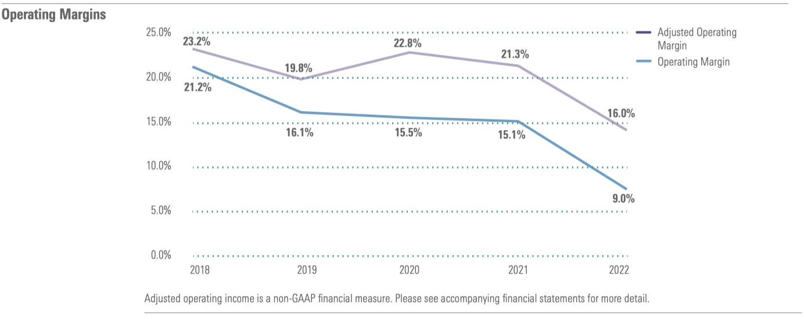

# `Columbia Engineering FinTech Bootcamp 2023-06 Cohort`

## `Project: Module 01 Intro-to-FinTech-Challenge`

## Case Study: Morningstar Office README 

## Background
> As a fintech professional, it’s critical for us to understand how fintech companies start, evolve, and grow, to be able to speak knowledgeably about the major players in the industry, and to stay up-to-date on advances in the rapidly evolving fintech field.

## Purpose
> In this activity, we use the ***case study*** method to conduct corporate research of a fintech business that analyzes how the company is addressing the needs and challenges in its fintech domain and using technology to solve a standing financial problem.

> In this Challenge, we will do the following:
> 1. Select a fintech domain that interests us, and then choose a company or project within that domain.
> 2. Research the domain and company.
> 3. Write a focused and detailed case study of the company or project.
> 4. Upload the [case study](https://github.com/boz-tcm/intro-to-fintech-challenge/blob/master/README.md) to our [git repository](https://github.com/boz-tcm/intro-to-fintech-challenge.git).

## Table of Contents
* [Background](#background)
* [Purpose](#purpose)
* [The Case Study - Morningstar](#the-case-study---morningstar)    
* [Technologies Used in this Project](#technologies-used)
* [Setup Documentation for this Project](#setup)
* [Project Status](#project-status)
* [Room for Improvement](#room-for-improvement)
* [Acknowledgements](#acknowledgements)
* [Contact](#contact)
<u>
## The Case Study - Morningstar Office
</u>

*`This Case Study is presented in a question and answer format.`*[^1]

- ## Overview and Origin

    * Name of company:
    
        `Morningstar, Inc. (the "Company"), headquartered in Chicago, IL, and publicly traded with most recent market cap valuation of $8.76 billion (Yahoo! Finance, June 2023).`

        `This case study focuses on Morningstar, Inc.'s` <u>**`Morningstar Office Cloud`**</u> `product for investment advisers and their clients.`

    * When was the company incorporated?
    
        `According to Morningstar's latest SEC annual report, the Company was incorporated in 1984 (SEC Annual Report, February 2023).`

    * Who are the founders of the company?
    
        `The Company's founder is Joe Mansueto, who has served as Chairman of the board since inception, and as CEO from 1984 to 1996 and from 2000 to 2016 (SEC Annual Report, February 2023).  The Morningstar name was inspired by the last line of Henry David Thoreau's novel 'Walden', which the founder Joe Mansueto read in college:`
        > `"The sun is but a morning star." - Henry David Thoreau (`*`Walden`*`, 1854)`
        >
        >>`(Morningstar Website - Our History.)`

    * How did the idea for the company (or project) come about?
    
        `The idea for Morningstar, specifically the Morningstar Office Cloud product, originated from familiarity with the Company in both the Wealth Management and Investment Management fintech domains, where the Company has a long history with origins as a leader in the analysis and rating of mutual funds.`

    * How is the company funded? How much funding have they received?
    
        `The Company is funded by publicly traded equity with a book value of $1.2 billion and short and long-term debt of $1.1 billion (Yahoo! Finance, June 2023).` 

- ## Business Activities

    * What specific financial problem is the company or project trying to solve?
    
        `The Company's mission since its founding has been to deliver financial information and analysis to its clients so that they can make better investment decisions.`    

    * Who is the company's intended customer?  Is there any information about the market size of this set of customers?
        
        `According to Gitnux, Morningstar "generates revenue through a diverse range of products and services catered to institutional and individual investors, as well as financial advisors" (2023).`

        `In 2022, the Company brought together several business units and products, including the Morningstar Office product, under a single umbrella called Morningstar Wealth.  The Company notes that they wished they had done this many years ago (SEC Annual Report, February 2023).`

        `Regarding Morningstar Wealth, the Company states that:`
        >`"Our vision here is meaningful. We are building a comprehensive, end-to-end wealth platform designed to help independent advisors through every step of their investment workflow. While established competitors exist in this space, we see it as a compelling opportunity."`
        >
        > `"We believe that positive secular trends in this space have a way to go. Household wealth has been rising globally, and investors are turning to advisors for help managing those assets. We’re well positioned to meet that demand: Morningstar is a well-known and trusted brand among advisors and their clients, with a nearly 40-year record of providing independent insights and views, transparency, and a commitment to investor success. We know this segment well and are bringing our capabilities together to create a best-in-class wealth-management platform that will streamline advisor workflows and help them deliver great financial advice to more people (SEC Annual Report, February 2023)."`

    * What solution does this company offer that their competitors do not or cannot offer? (What is the unfair advantage they utilize?)
    
        `Pursuant to its original mission in 1984, Morningstar has amassed proprietary ratings information and analysis covering a large proportion of the mutual fund industry.  The Company has since expanded this mission to include ratings and data analysis for publicly traded businesses.  Morningstar's mission is to deliver this information to  clients, including corporate and individual investors, and financial advisors, through various captive channels such as Morningstar Direct, Morningstar Advisor Workstation, and Morningstar Office (SEC Annual Report, February 2023).` 

    * Which technologies are they currently using, and how are they implementing them? (This may take a little bit of sleuthing–– you may want to search the company’s engineering blog or use sites like Stackshare to find this information.)
    
        `Based on personal firsthand conversations with Morningstar's Customer Success Manager (CSM), Anthony Odro, the Company primarily relies on Amazon's AWS cloud services to deliver its proprietary investment ratings data, solutions, and services to clients.`

        `In addition to Amazon AWS, StackShare shows that Morningstar uses the following technologies, among others:`
            
        - `jQuery, php, Java, Apache, Ruby, for web development and deployment;`
            
        - `CloudFlare for cloud security and delivery efficiency;`
            
        - `Google Analytics for analyzing web traffic to Morningstar online properties;`
            
        - `and New Relic for internal server performance and load monitoring.`
            
        - `The full list of Morningstar technologies documented by StackShare is available` [here](https://github.com/boz-tcm/intro-to-fintech-challenge/blob/master/Resources/Sources/MorningstarOfficeStackShare.pdf).

        `According to the Company's most recent SEC annual report:`
        
        > `"The Morningstar Data team applies emerging methods in artificial intelligence to regression, classification, deep learning, natural language processing, and optical character recognition to extract data from structured and unstructured content. The Morningstar Data team uses a 'human in the loop' approach where machine inferences are presented to a data analyst for validation. Validated data is published in Morningstar products and used to retrain and continuously improve the Morningstar Data team's machine learning models. This approach enables Morningstar to produce data faster without compromising the quality of data that our clients use in making sound investment decisions." (SEC Annual Report, February 2023).`

        `The Company deploys and maintains its Morningstar Office product through both the Cloud, via an internet web application, and a legacy version through a local Desktop C++ distributed application.  Both product types provide a suite of functionality for investment adviser users, including Clients & Accounts management, CRM database management delivered through Redtail CRM, a third-party vendor, Firm-level and individual Client reporting, Client Billing, including batch scheduling, and Research tools, including Morningstar analyst research covering individual company securities, mutual and exchange-traded funds, and annuities.`

        - `Morningstar Office Cloud: Investment Adviser Practice Home Page and Tools Preview:`
            
            
        
        `A separate website also provides a client-facing web portal, delivered synchronously from the same underlying database sources serving investment advisers through their Cloud and Desktop applications.  The client-facing web portal provides clients with historical household balance information by account custodian, through either a direct data feed with custodians or through Morningstar's third-party data aggregation service, ByAllAccounts (BAA).  Morningstar's Back-Office Services (BOS) reconciles these data feeds and client account balances and positions daily prior to the U.S. market open.  In addition to reporting on account balances and securities holdings information, the client web portal supports secure document storage and sharing between investment advisers and their clients.`

        - `Client Web Portal: Overview and Investment Page Previews:`

            

            

        `Morningstar also maintains a sophisticated asset allocation rebalancing and tax management website application for investment advisers, called Morningstar tRx, or Total Rebalance Expert, which was initially developed and commercialized by a third-party startup that is now wholly-owned by Morningstar (Neal, 2015).`

       - `Total Rebalance Expert: Infographics:`

            

            

        `Additional detailed tech specifications for both Morningstar Office Cloud and legacy Morningstar Office` *`Desktop`* `product versions is available` [here](https://github.com/boz-tcm/intro-to-fintech-challenge/blob/master/Resources/Sources/MorningstarOfficeTechSpec.pdf)`.`

- ## Landscape

    * What domain of the financial industry is the company in?
    
        `Morningstar offers its services primarily within the Wealth Management and Investment Management financial industry domains (Smith, 2022).`

    * What have been the major trends and innovations of this domain over the last 5-10 years?

        `Valuefy identifies the following areas where technology has impacted the Wealth Management domain over the last decade:`
        
        1. `As baby boomers retire, providers, end-users, and clients, are increasingly younger and more tech-savvy, demanding greater adoption of technology-based wealth management services and solutions.`
        2. `Wealth management businesses have increasingly turned to big data, the recording, storing, and managing of industry and client data.`
        3. `Artificial intelligence, or AI, has been adopted to drive investment, wealth management, and behavioral analysis, strategy, and predictions.`
        4. `Once the domain of back-offices, AI is increasingly being implemented in the front office where wealth managers engage directly with clients and the public.`
        5. `With increasing collection and use of big data, privacy, regulatory, and cybersecurity risks and policies have become greater concerns for companies, regulators, and the public writ large.`
        6. `Although technological growth within the Wealth and Investment Management domains over the last decade has been remarkable, certain areas, such as Robo Advising, which has experienced fits and starts over the last decade, remind us there is no replacement for humans in the client-advisor relationship, and that according to Valuefy "humans remain at the core of the wealth management industry" (Valuefy, 2020).`

    * What are the other major companies in this domain?
    
        `Other major companies offering similar services as Morningstar in the Wealth Management and Investment Management domains include:`
        
        `1. Bloomberg`

        `2. S&P Global`
        
        `3. Envestnet, parent company of competitor MoneyGuide`
        
        `4. Fidelity, parent company of competitor eMoney`
        
        `5. Orion`

        `(Sources: G2.com; Kitces.com)`

        `We also believe that Value Line, provider of equity analyst research, ratings, and proprietary data, is a competitor to Morningstar and its Office product within the Wealth and Investment Management domains.  This is further corroborated by noting that Value Line declines to provide analyst coverage or ratings for Morningstar, Inc. and its publicly traded common stock.`

- ## Results

    * What has been the business impact of this company so far?
    
        `Over the past 15 years, Morningstar, Inc. has grown at a compounded annualized total rate of 14.7%, as measured by annual stock price appreciation plus reinvested dividends.  The Company's growth has propelled it to a stock market valuation of $11.2 billion and mid-cap status, and over 12,000 full-time employees globally operating in 32 countries (Morningstar Office report, November, 2023; SEC Annual Report, February 2023).`

    * What are some of the core metrics that companies in this domain use to measure success? How is your company performing, based on these metrics?

        `Key performance indicators in the Wealth and Investment Management industry domains include:`
        
        - `Assets Under Management (AUM);`
        - `AUM per client household;`
        - `Revenue and revenue growth;`
        - `Retention rates; and`
        - `Profit margins and expense ratios`
        
            `(Heid, 2022)`
        
        `With respect to the Morningstar Office product, internally Morningstar measures success in the investment adviser space according to product license revenue growth, license retention rates, and market share.  While such figures are not publicly disclosed or available for the Office product itself, company-wide licensed-based revenue grew 18% on an organic basis in its latest fiscal year 2022, and represented 71.2% of 2022 consolidated revenue, up from 66.6% in 2021, and 67.3% in 2020 (asset-based revenue and transaction-based revenue, neither of which is associated with Morningstar Office, made up the remaining share of consolidated revenue).  Annual revenue renewal rates for Morningstar Data was approximately 104% in 2022 and 100% in 2021 (SEC Annual Report, February 2023).`

        `The Company noted in its latest annual letter that long-term shareholders have expressed concern about the Company's ongoing decline in margins:
        
        >`"Many of our long-term shareholders have noted the decline in our margins. This decline partially reflected market- and macro-driven weakness in product areas tied to assets under management and credit ratings. We’d expect to see those product areas rebound with improvements in the market environment."`
        >
        >>`"The decline also reflects the significant investments we’ve made in the business, particularly in Morningstar Sustainalytics, `**`Wealth`**`, and PitchBook. That’s meant expenses growing faster than revenue across these areas. While we think the investments will pay off over time, `*`there’s no doubt that with `* ***`Wealth`***  *` in particular, the market environment has meant that our expected returns have been delayed"`*` (emphasis added) (SEC Annual Report, February 2023).`

        `Consistent with the comments above, note the Company's persistent and meaningful decline in GAAP operating margins since at least fiscal year 2018:`

        

    * How is your company performing relative to competitors in the same domain?

        `According to the Company's Morningstar Report, Morningstar, Inc.'s total stock market value has grown 14.7% compounded annually over the last 15 years, trailing its industry benchmark by nearly 2%, which has grown 16.6% annually (Morningstar Office report, November, 2023).`

        `We believe the decline in margins may be tied to the Company over the last several years straying from its core competencies, including:`
        
        1. `Its material acquisitions of Pitchbook in 2016, followed by DBRS in 2019, which subsequently drew regulatory scrutiny and resulted in two cases settled with regulators tied to DBRS ratings practices, involving insufficient disclosures and transparency, and recordkeeping violations (Bautista, 2023), and Sustainalytics in 2020, which has since found itself mired in controversy, related to accusations of anti-Israel bias, promotion of greenwashing, and ratings actions driven by a social agenda (Goldberg, 2023; Rod, 2023), threatening not only the reputation of the Company itself, but also that of its customers;`
        2. `The accumulation of excesses across the Company writ large, reflecting reduced spending discipline and higher levels of cash and non-cash, or stock-based, employee compensation, and travel and entertainment expenditures, relative to income (Morningstar Q&A, 2022).`

- ## Recommendations

    * If you were to advise the company, what products or services would you suggest they offer? (This could be something that a competitor offers, or use your imagination!)
    
        `Since the Company's core customer for its Morningstar Office product is investment advisers, specifically registered investment advisers acting as fiduciaries, and their clients, we would advise the Company to develop a financial planning module within the Office product suite that is competitive with offerings provided by other companies in the Wealth Management domain.`

    * Why do you think that offering this product or service would benefit the company?
 
        `A bona fide financial planning module would naturally bolt onto the Company's Office product, which is already captive to investment advisers and their clients.  Marginal investment in this feature would likely be met with high adoption rates by investment advisers, who would likely switch from the primary companies in the domain, Fidelity's eMoney and Envestnet's MoneyGuidePro, and consolidate their wealth management technology platforms, budget, and resources with a single provider.`

    * What technologies would this additional product or service utilize?

        `Financial planning relies heavily on customized advice and input from clients.  Morningstar already provides a robust third-party, or held-away, data aggregator through its ByAllAccounts (BAA) unit, and data reconciliation and maintenance through its Back-Office Services (BOS).  A financial planning module would naturally leverage Morningstar's preexisting technology.`
        
        `Features and technology within a financial planning module that Morningstar should develop to be competitive with primary offerings in the Wealth Management domain include Monte Carlo simulation of income, budget, expenses, investment, and mortality scenarios, among others, and could incorporate machine learning and predictive analytics that would be commercially unrivaled in the domain.  In contrast, competitors' current offerings provide Monte Carlo simulation of investment portfolio returns only, a naive and not particularly sophisticated or powerful approach to wealth management.  Cynical advisers might claim that current financial planning offerings in the domain are primarily designed for marketing purposes, prospecting and client lead generation, rather than for providing robust, practical, and valuable financial planning advice sought by clients.`

    * Why are these technologies appropriate for your solution?

        `With $24.0 trillion residing in U.S. defined contribution and IRA retirement assets, and U.S. citizens now assuming more and more retirement risk via these plans, as companies and governments in recent decades have shifted from offering defined benefit retirement pension plans (currently $16.8 trillion), where ` *`employers`* ` have traditionally assumed the investment risk, retirees are in greater need of sophisticated and robust solutions to manage their retirement savings (Congressional Research Service, 2022).`
        
       `With many retirees now assuming such large retirement risks themselves, the public would benefit from customized financial planning tools and advice, including not only traditional and relatively naive technology, such as income, expense, budget, asset and liability modeling, coupled with Monte Carlo simulation, but also nascent technology that holds out the promise of more effective planning and risk management.  While many are apprehensive about emerging artificial intelligence (AI), the public can look forward to sophisticated financial planning tools that incorporate powerful predictive analytics and machine learning features that help them manage both traditional market risks and non-traditional behavioral risks.  Morningstar has a large opportunity set and addressable market, and occupies an ideal position to be part of this solution, through both its Wealth division and Office product.`

- ## References

    [^1]: A numbered footnote convention will generally not be used in this case study: references will instead be identified using MLA Source and Date citation convention, and listed [here](#references).  However, this numbered footnote instance illustrates how footnotes may be implemented in Markdown. Note that this footnote reference would not render properly, if at all, in VS Code prior to identification and installation of the VS Code extension developed by Matt Bierner, see VS Code Extension ID [bierner.markdown-footnotes](https://marketplace.visualstudio.com/items?itemName=bierner.markdown-footnotes).

    * Bautista, Christian, "Morningstar agrees to $8M settlement over CMBS ratings," October 25, 2023, *The Real Deal*, https://therealdeal.com/chicago/2023/10/25/morningstar-agrees-to-8m-settlement-over-cmbs-ratings.
    
    * Congressional Research Service, "U.S. Retirement Assets: Amount in Pensions and IRAs," May 23, 2022, https://crsreports.congress.gov/product/pdf/IF/IF12117/2.
    
    * G2.com, "Top 10 Morningstar Office Alternatives & Competitors," https://www.g2.com/products/morningstar-office/competitors/alternatives.

    * Gitnux.com, "Morningstar: Business Model, SWOT Analysis & Competitors 2023," April 10, 2023, https://blog.gitnux.com/companies/morningstar.

    * Goldberg, Richard, "Woke ‘ESG’ investors guilty of anti-Semitism as they target Israel," *New York Post*, January 24, 2023, https://nypost.com/2023/01/24/woke-esg-investings-anti-semitism-problem.

    * Heid, Brandon, "Financial Planning KPIs Your Firm Should Be Tracking", *eMoney*, February 22, 2022, https://emoneyadvisor.com/blog/financial-planning-kpis-your-firm-should-be-tracking/.

    * Iskowitz, Craig, "50 Portfolio Management Software Solutions For Advisors Can’t All Survive," July 23, 2020, https://www.kitces.com/blog/portfolio-management-trading-rebalancing-software-review-fintech-competition-addressable-market-size.

    * Morningstar Office Cloud, Morningstar Report, November 3, 2023, https://github.com/boz-tcm/intro-to-fintech-challenge/blob/master/Resources/Sources/Morningstar%20Office%20Cloud%20Report%20for%20Morningstar%2C%20Inc.pdf.

    * Morningstar Office Cloud and Desktop technical specifications, https://github.com/boz-tcm/intro-to-fintech-challenge/blob/master/Resources/Sources/MorningstarOfficeTechSpec.pdf.

    * Morningstar, Inc. Corporate Website - Our History, https://www.morningstar.com/company/about-us/timeline.

    * Morningstar Q&A, May 27, 2022, https://shareholders.morningstar.com/investor-relations/investor-qa/investor-qa-details/2022/Margins-have-come-under-some-pressure/default.aspx.

    * Morningstar SEC Annual Report on Form 10-K for the period ending December 31, 2022, as of February 24, 2023, https://www.sec.gov/ix?doc=/Archives/edgar/data/1289419/000128941923000005/morn-20221231.htm.

    * Neal, Ryan, "Morningstar Purchases tRx Portfolio Rebalancing Platform," October 9, 2015, https://www.wealthmanagement.com/technology/morningstar-purchases-trx-portfolio-rebalancing-platform.

    * Rod, Marc, "Morningstar removes controversy tags on 19 companies doing business in Israel and West Bank," *Jewish Insider*, July 6, 2023, https://jewishinsider.com/2023/07/morningstar-israel-ratings-sustainalytics-esg.

    * Singers, Mattias, "awesome-readme" demonstrated the use of html `` tag within README, https://github.com/matiassingers/awesome-readme.

    * Smith, Andy, "Who Are Morningstar's (MORN) Main Competitors," August 23, 2022, https://www.investopedia.com/ask/answers/051915/who-are-morningstars-morn-main-competitors.asp.

    * StackShare, https://stackshare.io/morningstar/morningstar.

    * Valuefy, "Impact of Technology on Wealth Management over the Last Decade," February 5, 2020, https://valuefy.com/impact-of-technology-on-wealth-management-over-the-last-decade.

    * Wikipedia reference for Markdown, https://en.wikipedia.org/wiki/Markdown#cite_note-philosophy-9.

    * Yahoo! Finance, June 15, 2023, https://finance.yahoo.com/quote/MORN?p=MORN.

## Technologies Used
- README Markdown file for Case Study developed within VS Code IDE.

    > According to Wikipedia, 
    >>*"Markdown is a lightweight markup language for creating formatted text using a plain-text editor. John Gruber created Markdown in 2004 as a markup language that is easy to read in its source code form. Markdown is widely used for blogging and instant messaging, and also used elsewhere in online forums, collaborative software, documentation pages, and readme files" ([Wikipedia](https://en.wikipedia.org/wiki/Markdown#cite_note-philosophy-9)).*

## Setup
- GitHub Repository
    - name: 'intro-to-fintech-challenge'
    - location: uploaded to Bootcamp homework submission online portal and available publicly at:
        - [GitHub Repository](https://github.com/boz-tcm/intro-to-fintech-challenge.git)
- Case Study README.md file
    - name: 'README.md'
    - location: [Case Study](https://github.com/boz-tcm/intro-to-fintech-challenge/blob/master/README.md) 

## Project Status
Project is: _complete

## Room for Improvement
Room for improvement: 
- _Investigate an hierarchical table of contents structure for the Case Study section itself.

To do:
- _None

## Acknowledgements
[Markdown cheatsheet](https://www.markdownguide.org/cheat-sheet/) was quite the useful resource, serving particularly as idea generator, explorer, and reference companion.

## Contact
Created by Todd C. Meier, tmeier@bozcompany.com - feel free to contact me!

<!-- ## License --> All rights reserved.
---
## Footnotes